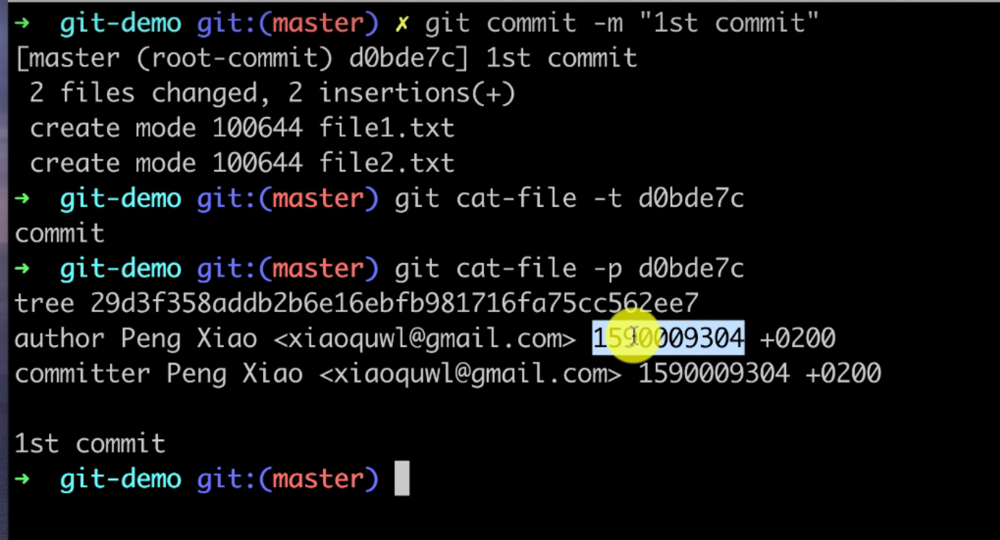
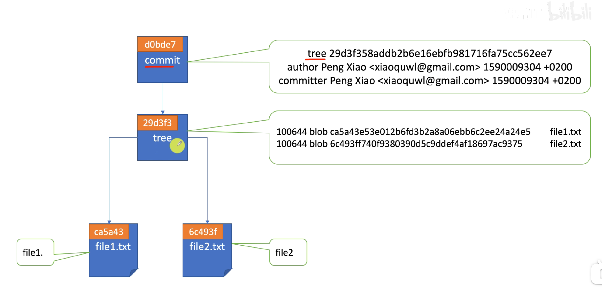

## config 文件

```shell
mkdir git-demo

cd git-demo

ls -la

git init

# 查看 config 文件
cat .git/config

# 查看全局配置文件
cat ~/.gitconfig

# 列出全局配置
git config --global -l

# 配置用户名和邮箱
git config user.name "demo"
git config user.email "demo@demo.com"
```

Tips:

- Ctrl + R 搜索命令历史
- 监控文件

```shell
# 没隔 1 秒刷新当前的文件目录，并打印
watch -n 1 -d find .

# 删掉 hooks 里面的 sample 的文件
rm -rf.git/hooks/*.sample
```


## git add 发生了什么

会生成 blob 对象，文件内容的 hash 值（注意不是文件名）在 `.git/objects/8d/xxxxxxx` 这里，文件内容会被压缩，hash 值的文件名其实就是文件内容。可以借助一些工具读取压缩后的内容（python 的 zlib）

```shell
# hello git 写入 hello.txt （会自动创建该文件）
echo "hello git">hello.txt

# 看 .git 目录结构 （貌似要安装 tree）
tree .git

# 看 hash 对象的类型
git cat-file -t [hash 值]

# 看对象的内容
git cat-file -p [hash 值]

# 创建文件
touch test.txt
```

Tips:

- tree 命令的使用
- SHA-1 是一种 hash 算法 可以把文件内容变成一段加密的字符


## blob 对象和 SHA1 哈希

Hash 算法：把任意长度的输入通过散列算法变成固定长度的输出。

常见的 Hash 算法和对应的输入长度如下，理论上越长越难破解。

- MD5 128bit :x: 个人电脑几小时就可以破解 MD5 的原始输入，现在常用于验证文件的完整性
- SHA1 160bit :x: git 中会使用
- SHA256 256bit 需要保密的程序是 256 起
- SHA512 512bit


Tips:

在线计算 MD5 or SHA1 or 256 
https://passwordsgenerator.net/md5-hash-generator

```shell
# 使用 macOS 自带的方式计算 "hello git" 的 SHA1
echo "hello git" | shasum

# 看文件大小
ls -lh

# git 计算的 SHA1 包含了下面的信息
echo "blob [文件大小]\0[文件内容]"

# git cat-file 可以读取上面的信息(类型 内容 大小)
git cat-file -t [hash 值]
git cat-file -p [hash 值]
git cat-file -s [hash 值]
```


## 工作区和索引区/缓存区

Working Directory

Staging Area ( .git/index ) : 为代码仓库做准备 状态 目录名 文件名

Git Repository

```shell
# 文件名信息存在 index
cat .git/index

# 列出当前在索引区的文件
git ls-files

# 列出文件权限，对应的 blob 对象，0，文件名
git ls-files -s

# 比较工作区和索引区的区别
git status

# 编辑文件
vim [文件名]
```


## git commit 发生了什么

会生成两个对象：

- commit 对象包括  tree, author, committer
- tree 对象包含 blob 对象，文件名

```shell
git commit -m "1st commit"

# 会产生一个 commit 类型的对象
git cat-file -t [hash 值]
```

（git add 产生了 blob 对象， 他们都在 objects 下面）







## 文件状态

- Untracked
- Modified
- Staged
- Unmodified


## Branch 和 HEAD

Branches are named pointers to commits.

- Master is a branch, the canonical mainline branch by default
- HEAD is a special pointer
  - Related with current active branch
  - Always point to the latest commit

```shell
# 看 HEAD 的内容
cat .git/HEAD
# 打印 ref: refs/heads/master

cat .git/refs/heads/master
# 打印 hash 值

git cat-file -t [上面的 hash]
# 打印 commit, HEAD 是指向的是个 commit

```


## 分支操作的背后

- `git branch`: list and branches we have

- `git branch <branch_name>`: created a branch with branch_name, if there already have branch with the name you want to create, it will return error 

- `git branch -D <branch_name>`: delete branch, can't delete current active branch or branch not existing

- `git branch --delete <branch_namr>`: 只有被 merge 的分支才能被删除，推荐使用

  - 删除一条分支：

    `git branch \-D branchName`

  - 删除当前分支外的所有分支：

    `git branch | xargs git branch \-d`

  - 删除分支名包含指定'dev'的分支：

    `git branch | grep 'dev\*' | xargs git branch \-d`

  - `| `

    > 管道命令，用于将一串命令串联起来。前面命令的输出可以作为后面命令的输入。

  - `git branch` 

    > 用于列出本地所有分支。

  - `grep` 

    > 搜索过滤命令。使用正则表达式搜索文本，并把匹配的行打印出来。

  - `xargs` 

    > 参数传递命令。用于将标准输入作为命令的参数传给下一个命令。

    [参考](https://segmentfault.com/a/1190000022215551)

- `git checkout`: change the current active branch

```shell
git log

# 查看 dev 指针的信息，返回的是 hash 值
cat .git/refs/heads/dev

# 查看 HEAD
cat .git/HEAD
# 打印 ref: refs/heads/dev
```


Tips: 

- 删除只删除分支名，其他没有删除 （类似每次 git add 后产生的 object , 有 blob, commit 等）

```shell
git cat-file -t [被删除的分支的 hash]
# 打印 commit

git cat-file -p [被删除的分支的 hash]
# 打印 tree parent author committer
```

- checkout 可以检出特定的分支 也可以是特定的 commit

```shell
# 找回删除的分支 (第十集)
git reflog
# 打印类似操作记录的东西

git checkout [特定的 commit]
```


## git diff

1. 对比工作区和索引区的差别（add 之前）

```shell
--- 索引区
+++ 工作区

@@ -4,7 +4,7 @@
# 索引区的第四行开始，往后数七行
```

2. 索引区和代码仓库（add 之后）

```shell
git diff --cache
```


Tips:

- 插件 oh-my-zsh git plugin
- `git cat-file -p` 看的是 .git/object 下的内容


## 远程仓库

```shell
# 查看远程
cat .git/refs/remotes/origin/master

# 查看本地
cat .git/refs/heads/master
```


## Git 对象的压缩

```shell
# 看文件大小
ls -lh [文件路径]

# 看文件大小分布
du -h .git/objects

# 删除 .git
rm -rf .git

# 看文件大小分布
du -h .git/objects

# 直接打开文件
vim [文件名]
```

每次的 add commit, 哪怕只是改变一点点的字符，git 也会存储整个对象的压缩

```shell
git gc
# 会压缩 objects 对象到 pack
```


Tips:

```powershell
# 看 SHA1 
shasum [文件名]

shasum -a 256 [文件名]


# 看索引区的大小
git ls-files -s
```


